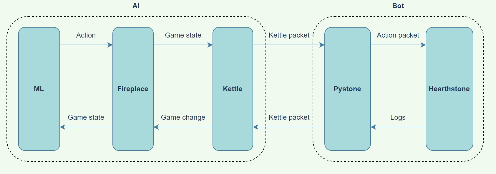
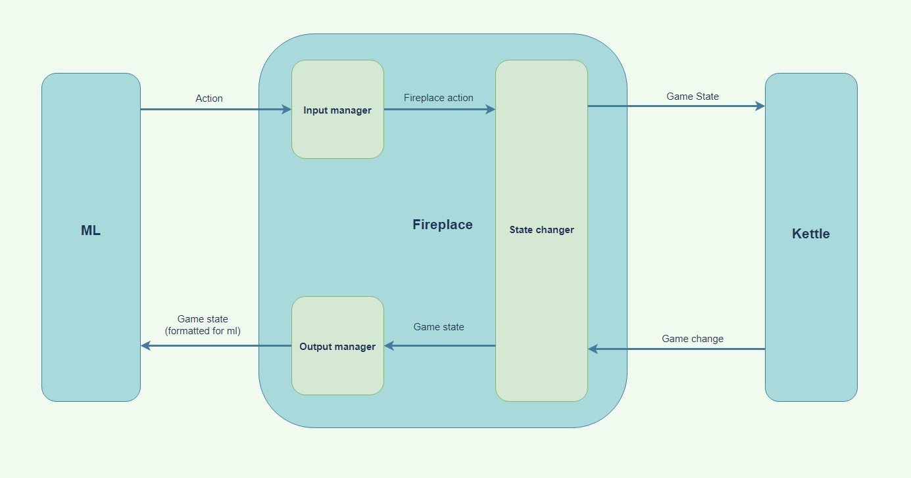
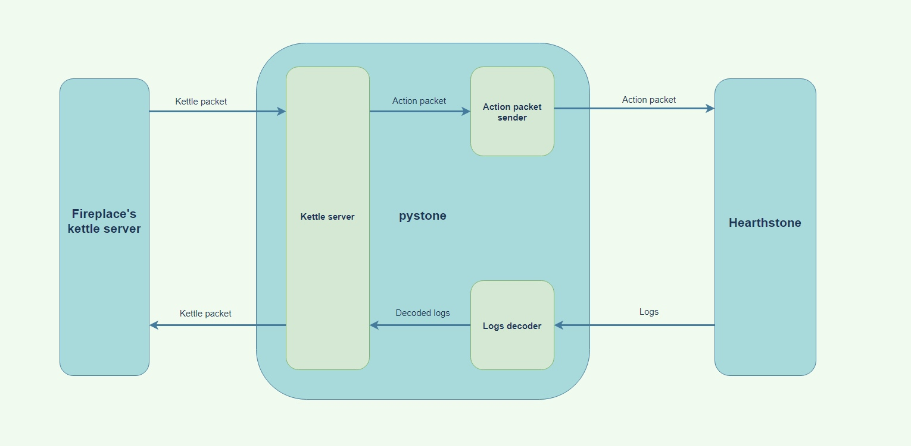
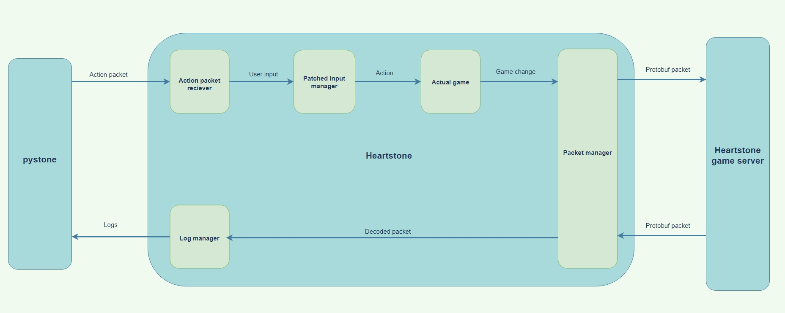

# Hearthstone bot using machine learning
### Description
This project is made for project practice at NRNU MEPHI.
This is a bot for Hearthstone using Neural Network Deep Learning.

### Demo

### General Scheme

### Neural Network interaction with Fireplace and Kettle Scheme

### Fireplace and Pystone interaction with Hearthstone scheme

### Hearthstone inner interactions Scheme

