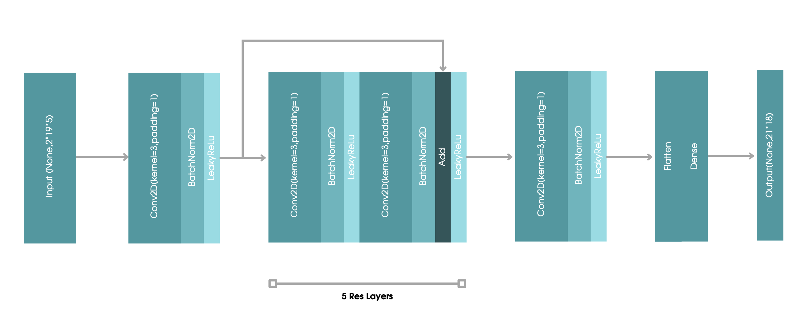
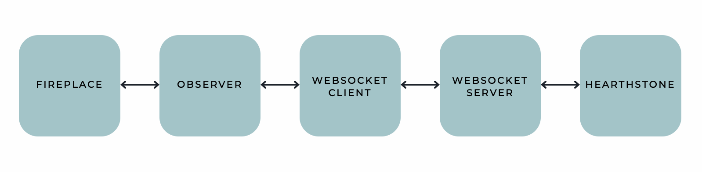

# Hearthstone bot using machine learning
### Description
This project is made for project practice at NRNU MEPHI.
This is a bot for Hearthstone using Neural Network Deep Learning.

### Demo
Wait, please, this gif is a little heavier than we expected

### Fireplace UI Demo

#### Neural Network repo
https://github.com/PotatoHDs/neural-hearthstone
#### Patch repo
https://github.com/PotatoHDs/hearthstone-bot
#### Fireplace log repo
https://github.com/PotatoHDs/hs-log-fireplace
### General Scheme

### Neural Network

### Fireplace UI

### JSON & Logs

